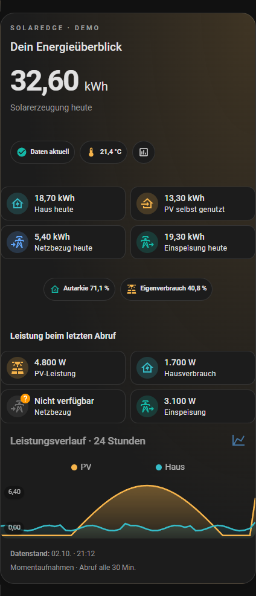

# SolarEdge auf deinem Dashboard

Eine Übersicht mit Tageserzeugung, Hausverbrauch, Netzbezug, Einspeisung, PV-Eigenverbrauch, Autarkie, vier Leistungskacheln, 24-Stunden-Verlauf, Temperatur und Datenzustand. Über das Diagramm-Symbol gelangst du zum Home-Assistant-Energie-Dashboard. Antippen der Werte öffnet ihre Details. Die optionale zweite Karte ergänzt sämtliche Energiezähler und Diagnosewerte; beide Karten zusammen zeigen alle 30 Sensoren.

**Vorschau mit Beispieldaten**, aus der getrennten HA-Testinstanz; Werte und Verlauf sind synthetisch. Deine Karte zeigt die tatsächlichen Sensorwerte.

[Vorschau im hellen Theme](preview-light.png)

## Einfügen

Ab dieser Vorlage wird **Add-on 0.3.0** benötigt. Zuerst das Add-on aktualisieren, dann den Inhalt der bestehenden Karte vollständig ersetzen. Die HACS-Erweiterungen bleiben dieselben.

Die Übersicht nutzt **Mushroom**, **mini-graph-card** und **card-mod**. Diese drei Erweiterungen sind in deiner gezeigten HACS-Liste bereits vorhanden. card-mod liefert auch die gemeinsame Kartenhülle; zusätzliche Helfer oder Änderungen an der Add-on-Konfiguration sind nicht erforderlich.

1. Dein normales Dashboard öffnen, **⋮ → Dashboard bearbeiten → Karte hinzufügen** wählen.
2. Ganz unten **Manuell** auswählen.
3. Den Inhalt von [solaredge-overview.yaml](solaredge-overview.yaml) vollständig in den Karteneditor kopieren, vorhandenen Text ersetzen und speichern. Im GitHub-Dateifenster öffnet **Raw** den reinen Text.
4. Für die Zähler und alle übrigen Werte eine weitere manuelle Karte mit [solaredge-details.yaml](solaredge-details.yaml) hinzufügen.

**Die Dateien sind einzelne Karten.** Nicht in `configuration.yaml` oder in den YAML-Editor des gesamten Dashboards einfügen. Neue Sensoren werden vom Add-on ab 0.3.0 automatisch über MQTT angelegt. In einem Dashboard mit Abschnitten kann die Übersicht für mehr Platz über die Layout-Einstellungen auf die volle Abschnittsbreite gesetzt werden.

## Was du siehst

| Anzeige | Sensor / Bedeutung |
| --- | --- |
| Große Zahl | `sensor.solaredge_energy_today`: PV-Erzeugung heute in kWh |
| PV-Leistung | `sensor.solaredge_pv_power`: Leistung beim letzten Abruf |
| Hausverbrauch | `sensor.solaredge_consumption_power`: Verbrauchsleistung beim letzten Abruf |
| Netzbezug / Einspeisung | Jeweilige Leistungswerte beim letzten Abruf |
| Diagramm | PV- und Hausleistung aus deiner HA-Historie, in kW, vergangene 24 Stunden |
| Tagesbilanz | Heute verbrauchte, bezogene, eingespeiste und selbst genutzte Energie in kWh |
| Autarkie | Anteil des Hausverbrauchs, den die PV deckt |
| Eigenverbrauch | Anteil der PV-Erzeugung, den das Haus selbst nutzt |
| Status | Datenzustand einschließlich Alter und notwendiger Anmeldung |
| Datenstand | Zeitpunkt des letzten erfolgreichen Abrufs in deiner HA-Zeitzone |
| Zähler & Details | Fünf Energiezähler seit Einrichtung sowie Anlagen- und Abrufinformationen |

Der Standardabruf erfolgt alle **30 Minuten**. Die Leistungen sind Momentaufnahmen; die Kurven verbinden erfasste Werte und erlauben keine Aussage über die Leistung zwischen den Abrufen. Neue Installationen müssen erst Historie sammeln. Der Verlauf benötigt Home Assistants Recorder; die beiden Leistungssensoren dürfen dort nicht ausgeschlossen sein.

Fehlende Daten werden nicht als Null dargestellt. SolarEdge zeigt möglicherweise nur die gerade aktive Netzrichtung an; die andere Leistungskachel kann dann **nicht verfügbar** sein. Die Tagesbilanz kommt unabhängig davon aus den Energiewerten. Prozentsätze bleiben bei einem Nenner von null unavailable. Die Tageswerte werden am lokalen Mitternachtswechsel bis zum nächsten erfolgreichen Abruf unavailable.

Der Statuschip berücksichtigt das Alter seit dem letzten erfolgreichen Abruf. Die Warnschwelle kommt vom Add-on und ist mindestens 15 Minuten oder drei Abrufintervalle, beim Standard also 90 Minuten. Die Fußzeile zeigt das tatsächliche Abrufintervall sowie Fehler beim Historienimport. [Optionale Benachrichtigung aufs Handy](../blueprints/README.md).

Die Gesamtzähler stehen bewusst separat als **Energiezähler seit Einrichtung**. Es sind weder Tageswerte noch die gesamte historische Produktion deiner Anlage. Für Tages-, Wochen- und Monatsbilanzen verwende das reguläre [Energie-Dashboard](../README.md#energie-dashboard) mit den [tagesgenauen Statistikquellen](../solaredge_web/HISTORY.md).

## Wenn eine Karte oder ein Wert fehlt

- **„Custom element doesn't exist“:** Die genannte Erweiterung in HACS öffnen, ihre Dashboard-Ressource prüfen und den Browser vollständig neu laden. Die drei benötigten Ressourcen müssen als JavaScript-Module eingebunden sein. `mod-card` gehört zu card-mod.
- **„Entität nicht verfügbar“ / fehlender Wert:** Unter **Einstellungen → Geräte & Dienste → Entitäten** nach `solaredge` suchen. Die Dateien verwenden die Standard-IDs des Add-ons. Wenn HA einen Suffix wie `_2` vergeben hat oder du Sensoren umbenannt hast, ersetze die betreffende ID überall in beiden Dateien. Das gilt auch für IDs in den Textvorlagen.
- **Leeres Diagramm:** Erst nach erfolgreichen Abrufen und gespeicherter Historie erscheinen Punkte. Prüfe Recorder und Sensor-IDs. Diese Karte startet keine zusätzlichen SolarEdge-Abfragen.
- **Andere Farbgestaltung:** Hintergrund und Text folgen deinem hellen oder dunklen HA-Theme. Die Symbolfarben werden direkt gesetzt, damit PV goldfarben und Hausverbrauch türkis bleiben, auch wenn das Theme Farbnamen umdefiniert. Der warme Verlauf und die Rundung werden durch card-mod ergänzt.
- **Kleine Tageszahl oder fehlende Formatierung:** Die aktuelle Übersicht setzt die Überschrift zusätzlich über die gemeinsame Kartenhülle. Ersetze den kompletten Karteninhalt durch die aktuelle Datei und lade den Browser vollständig neu (am PC etwa mit **Strg+F5**). Die in HACS angezeigte Version allein bestätigt nicht, dass der Browser bereits die aktuelle Erweiterung geladen hat. Wenn Formatierung weiterhin fehlt, die Dashboard-Ressourcen auf doppelte oder veraltete card-mod-Einträge prüfen; siehe die [Hinweise des card-mod-Projekts zu Versionen und Cache](https://github.com/thomasloven/lovelace-card-mod#installing).

## Prüfung

Beide Dateien lassen sich als YAML laden und verwenden ausschließlich die 30 vom Add-on veröffentlichten Sensoren. Die Vorlagen wurden in einer getrennten Home-Assistant-Instanz mit Zahlen, echten Nullwerten, fehlenden Werten sowie alten und fehlenden Abrufzeitpunkten geprüft.

Die Karten wurden in Home Assistant 2026.9.4 mit Mushroom 5.2.3, mini-graph-card 0.13.0 und card-mod 4.2.1 dargestellt. Helles und dunkles Theme sowie schmale Bildschirmbreiten wurden geprüft. Browserfehler wurden dabei nicht festgestellt. Die Vorschau verwendet ausschließlich Beispieldaten, keine Zugangsdaten oder echten Anlagenwerte.

Die große Tageszahl wurde zusätzlich ohne die lokalen Markdown-Stile geprüft; die Hülle stellt ihre Größe weiterhin korrekt ein. Eine geänderte Theme-Farbe für Amber verändert die direkt gesetzte PV-Symbolfarbe nicht.

Die Kartentypen sind anhand ihrer offiziellen Dokumentation konfiguriert: [Mushroom](https://github.com/piitaya/lovelace-mushroom), [mini-graph-card](https://github.com/kalkih/mini-graph-card), [card-mod](https://github.com/thomasloven/lovelace-card-mod).
